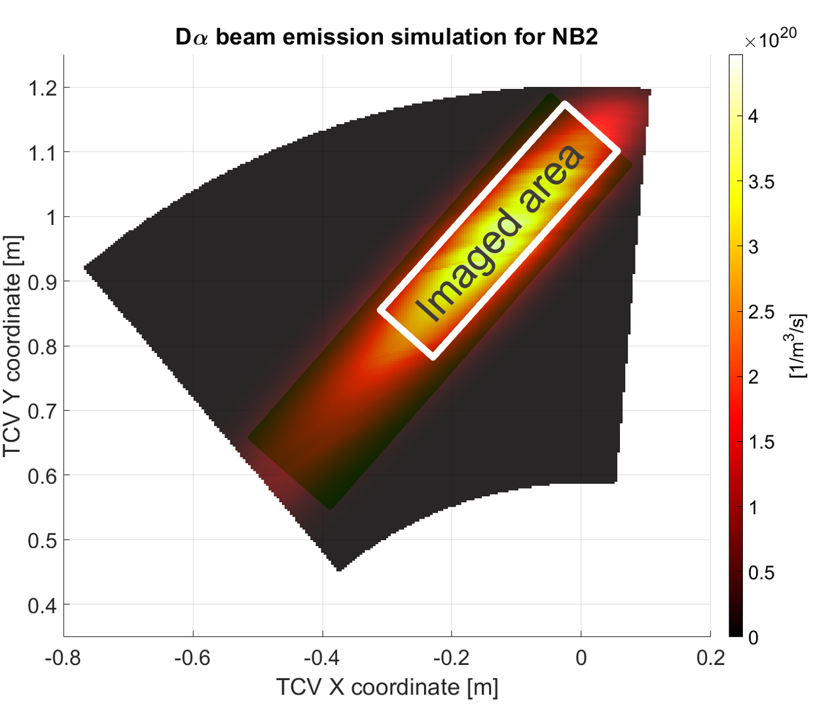
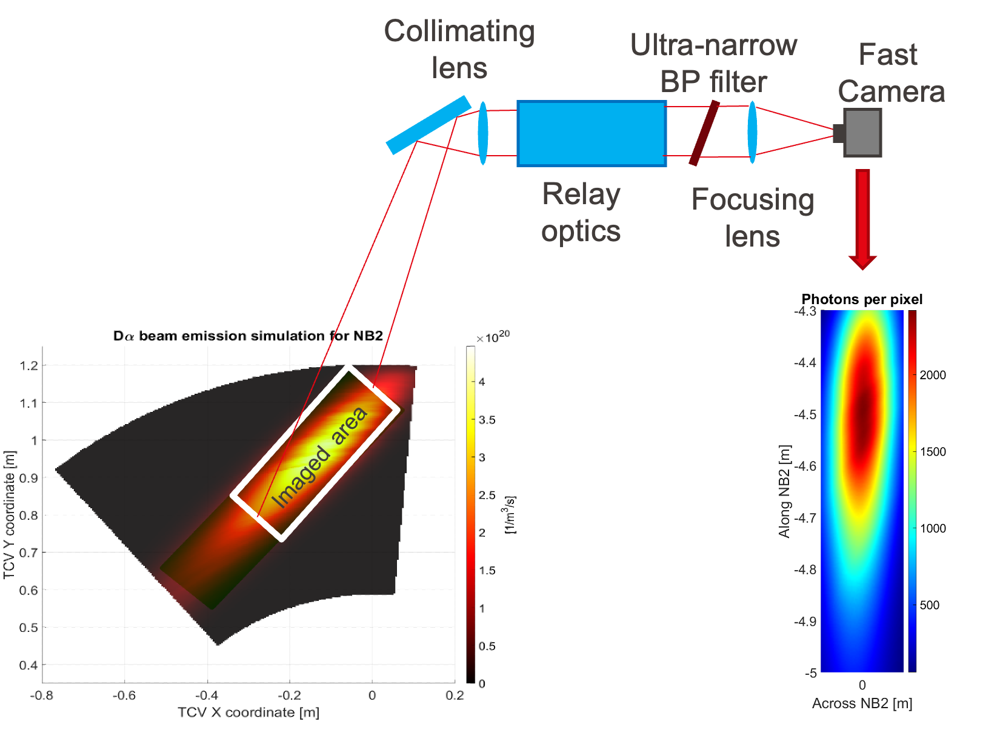
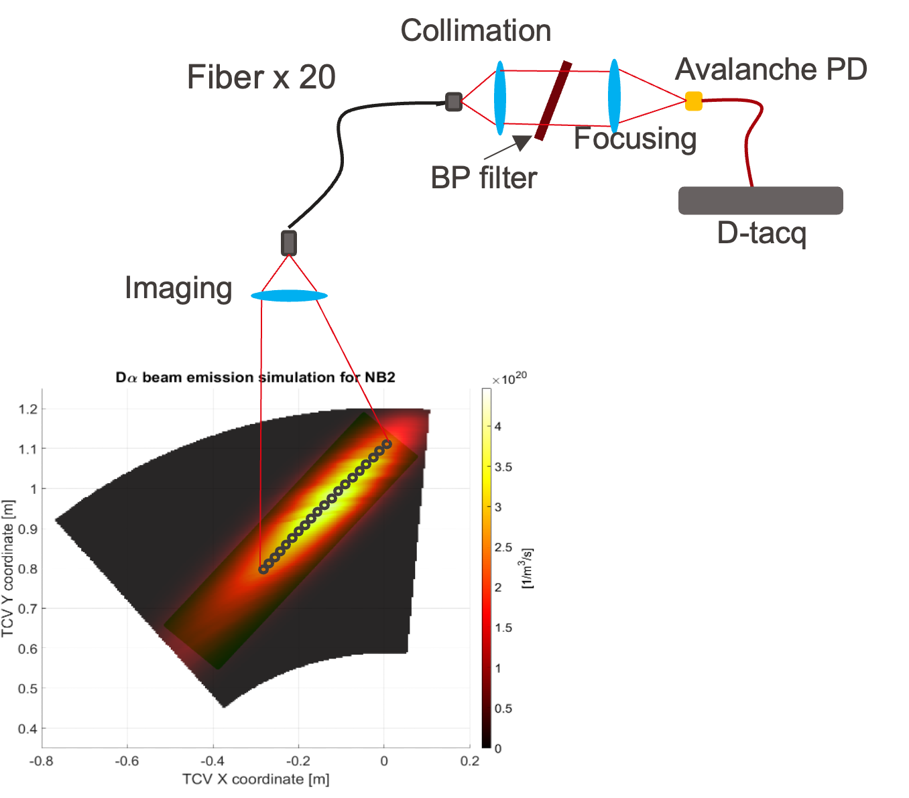

## Introduction

Beam Emission Spectroscopy (BES) is an active spectroscopy diagnostic used in magnetically confined plasmas to measure density perturbations and their dynamics. The method relies on the injection of a neutral beam into the plasma and on the observation of the line radiation emitted by beam atoms after collisional excitation. In practice, BES isolates the beam-induced D$\alpha$ emission and uses its spatio-temporal modulation as a proxy for local plasma fluctuations. This makes BES particularly valuable for the study of turbulence, magnetohydrodynamic (MHD) activity, correlation lengths, and fluctuation spectra.

In the present TCV context, the proposed BES implementation is based on observations of the Doppler-shifted D$\alpha$ light from NBI-2. The design currently considers two complementary systems looking along the same beam: an **imaging BES** branch optimized for high spatial resolution and a **fast-acquisition BES** branch optimized for high temporal resolution.

## Theoretical background

### Principle of the measurement

When neutral deuterium from the beam penetrates the plasma, beam atoms are collisionally excited by plasma particles and subsequently emit Balmer radiation, in particular D$\alpha$. The measured emissivity can be written schematically as

$$
\varepsilon_{D_\alpha} \propto n_b\,n_e\,\langle \sigma v \rangle_{\mathrm{exc}},
$$

where $n_b$ is the local neutral beam density, $n_e$ the electron density, and $\langle \sigma v \rangle_{\mathrm{exc}}$ an effective excitation rate coefficient. Under conditions in which the beam properties and optical throughput are sufficiently stable, fluctuations of the detected signal can be related, to first order, to plasma density fluctuations:

$$
\frac{\delta I}{I} \approx C_n\frac{\delta n_e}{n_e} + C_T\frac{\delta T_e}{T_e} + C_b\frac{\delta n_b}{n_b} + \cdots
$$

In many BES applications, the dominant term of interest is the density-fluctuation contribution, while the remaining terms must be minimized, calibrated, or interpreted carefully.

### Why Doppler-shifted D$\alpha$ is used

A crucial experimental issue is the separation of beam-induced light from intense background plasma emission. Because the injected neutral beam has a large velocity, the D$\alpha$ radiation produced by the beam is Doppler shifted relative to the passive D$\alpha$ background. An ultra-narrow band-pass filter can therefore be tuned to transmit mainly the beam emission. This substantially improves the selectivity of the diagnostic and makes localized fluctuation measurements feasible.

### Spatial and temporal information

BES does not measure a mathematical point value, but a signal integrated over a finite observation volume defined by the beam geometry, the line of sight, the optical system, and the atomic physics of excitation and emission. The diagnostic design is therefore a compromise between spatial localization, temporal resolution, and photon statistics:

- high spatial resolution is needed to resolve short radial correlation lengths;
- high temporal resolution is needed to resolve turbulence and MHD spectra;
- sufficient photon flux is needed to maintain an acceptable signal-to-noise ratio.

This trade-off is precisely why the TCV concept is attractive in a dual configuration: one system emphasizes spatial detail, while the other emphasizes fast fluctuation dynamics.

## Historical overview

BES has become a standard active spectroscopy technique for fluctuation studies in tokamaks because it combines local sensitivity with direct access to density perturbations. Over time, BES implementations have evolved in two main directions. One direction uses arrays of discrete lines of sight and fast detectors to obtain high-bandwidth fluctuation measurements. The other direction pushes toward imaging approaches, in which a larger portion of the beam is observed simultaneously to recover finer spatial structure.

For the TCV project, this evolution is reflected directly in the two proposed concepts. The **fast-acquisition BES** design follows a proven line of development: according to the project presentation, similar diagnostic concepts have already been implemented on **DIII-D, TFTR, MAST, and HL-2A**. The **imaging BES** concept extends the diagnostic toward higher-resolution two-dimensional observation of the beam emissivity pattern, with the aim of improving spatial characterization and enabling simultaneous low-field-side and high-field-side measurements.

## BES concept for TCV

### Motivation for a measurement along NBI-2

The TCV proposal focuses on the Doppler-shifted D$\alpha$ emission produced along **NBI-2**. This geometry is appealing for several reasons:

- it gives access to density fluctuations with high spatial or temporal resolution, depending on the branch used;
- it can provide simultaneous information from the low-field side (LFS) and high-field side (HFS);
- it offers a route to improved signal-to-noise ratio through averaging along magnetic-field-aligned structures;
- it can be integrated with relatively limited modifications, since the imaging concept is designed to be compatible with the existing MSE diagnostic support.

@fig-imaged-area shows the simulated D$\alpha$ beam emission for NB2 and the region selected for BES observation.

{#fig-imaged-area width=70%}

### Imaging BES system

The first branch is an **imaging BES** system designed for high-resolution studies of density fluctuations. Its main purpose is to investigate turbulence- and MHD-induced perturbations with sufficiently fine spatial sampling to estimate radial correlation lengths accurately. Because the observed region extends along the beam, the concept also enables simultaneous LFS and HFS measurements, which is particularly interesting for the detection of large field-aligned eddies in low-shear or shearless scenarios. A more detailed discussion of detector technologies for this branch is given in [CMOS, CCD and EMCCD detectors for BES imaging](CMOS_CCD.qmd).

The proposed optical chain is:

**Collimating optics $\rightarrow$ Relay optics $\rightarrow$ Ultra-narrow band-pass filter $\rightarrow$ Focusing optics $\rightarrow$ Fast camera**.

A key feature of this design is the use of approximately 1 m of relay optics, which allows the camera to be placed outside the strongest TCV magnetic-field region. The ultra-narrow band-pass filter selects the Doppler-shifted beam D$\alpha$ emission, while the camera records short-exposure images at high frame rate.

The main design targets reported in the presentation are:

- spatial resolution of about **2 mm**;
- acquisition frequency up to **20 kframes/s**;
- exposure time of **10-20 $\mu$s**;
- radial coverage of about **0.83-1.15 m**.

#### Detector choice for the imaging branch

For this imaging system, the detector choice is not neutral. In practice, a **CMOS camera** is the most suitable solution for the TCV implementation, because the diagnostic requires short exposure times together with acquisition frequencies in the **10-20 kframes/s** range. A CCD-based solution would offer a more uniform readout, but it would be less natural for this high-speed operating mode and would generally come with stronger readout limitations. An EMCCD would retain the CCD advantages in terms of low-light performance and uniformity, but at significantly higher cost.

The CMOS choice therefore reflects a practical compromise:

- it enables high frame rate and short exposure time;
- it avoids the classical CCD readout-smearing issue;
- it is generally more cost-effective for this use case;
- it comes at the price of higher noise, less uniform background, and a greater need for image correction during analysis.

This point is important for interpretation. If the relevant plasma fluctuations are of order **100 kHz**, then the imaging branch should not be expected to resolve their temporal correlation directly. Its main strength is instead the recovery of **spatial correlation** and fluctuation structure along the beam. In that sense, the imaging BES branch is primarily a high-spatial-information diagnostic rather than a high-temporal-bandwidth one.

{width=65%}

### Fast-acquisition BES system

The second branch is a **fast-acquisition BES** system designed to emphasize temporal resolution. Its objective is to measure the time evolution of the Doppler-shifted D$\alpha$ signal with sufficient bandwidth to characterize fluctuation spectra, turbulence-driven activity, and MHD signatures. This branch is also attractive for estimating the amplitude distribution of density fluctuations and for performing single-shot parameter scans, in which plasma conditions change during one discharge.

The proposed chain is:

**Imaging optics $\rightarrow$ Fiber bundle $\rightarrow$ Collimating optics $\rightarrow$ Ultra-narrow band-pass filter $\rightarrow$ Focusing optics $\rightarrow$ Avalanche photodiode $\rightarrow$ D-tacq**.

In this concept, the imaging optics select observation points along the beam and couple the light into a fiber bundle with up to **20 lines of sight**. After spectral filtering and focusing, the light is detected by avalanche photodiodes and acquired with fast electronics. More generally, this branch illustrates why discrete-channel detectors remain essential for BES whenever the priority is **high temporal bandwidth** rather than two-dimensional imaging: MHz-class sampling is naturally pursued with fiber-coupled channels and fast photodetectors, not with a camera.

The main design targets reported in the presentation are:

- spatial resolution of about **15 mm**;
- acquisition frequency up to **1 MHz**;
- radial coverage of about **0.83-1.15 m**.

{width=65%}

### Complementarity of the two systems

The strength of the proposed TCV BES design is the complementarity between the two branches:

- the **imaging system** prioritizes spatial resolution and structure characterization;
- the **fast-acquisition system** prioritizes temporal bandwidth and fluctuation spectroscopy;
- both systems exploit the same physical principle, namely Doppler-selected D$\alpha$ emission from NBI-2;
- together they provide a flexible platform for studying turbulence, MHD activity, correlation lengths, spectral content, and possible LFS-HFS asymmetries.

In other words, the imaging branch answers the question **"where is the fluctuation structure and how extended is it?"**, while the fast branch answers **"how fast does it evolve and with which spectral content?"**

## Outlook

From a diagnostic point of view, the proposed BES development on TCV is attractive because it couples a relatively straightforward integration path with a broad physics reach. The imaging branch appears especially promising for high-resolution spatial studies, whereas the fast-acquisition branch builds on an already established BES tradition in other devices. If both concepts are implemented successfully, TCV would gain a versatile diagnostic set for fluctuation studies along NBI-2, spanning both fine spatial localization and high-bandwidth temporal analysis.
