## Introduction

The *Stark Effect* is the shifting and splitting of electronic energy levels due to an external electric field. The *Motional-Stark Effect (MSE)* is the specific case in which the electric field is the Lorentz electric field felt by an atom moving in a magnetic field $\mathbf{B}$ at a velocity $\mathbf{v}$, evaluated in its rest frame: $\mathbf{E} = \mathbf{v} \times \mathbf{B}$. 

In plasma physics, the MSE serves as a crucial diagnostic tool for determining the poloidal magnetic field $\mathbf{B_P}$ within the plasma.  Accurate knowledge of the poloidal magnetic field is essential for understanding plasma stability and the formation of Internal Transport Barriers (ITBs). Additionally, MSE measurements enable inference of the plasma current distribution, since the current density $\mathbf{J}$ is related to the magnetic field $\mathbf{B}$ through Ampère's law:

$$
\nabla \times \mathbf{B} = \mu_0 \mathbf{J}
$$

In TCV, the poloidal magnetic field is routinely determined by the LIUQE (from "EQUIL" spelt backwards) code, an equilibrium code based on the resolution of the Grad-Shafranov equation, alongside magnetic probe measurements outside the plasma. However, when using Neutral Beam Heating (NBH) and Electron Cyclotron Resonance Heating (ECRH), the plasma equilibrium velocity is no longer negligible, and the magnetic field is locally influenced. This explains the need for the MSE diagnostic, which provides a direct measurement of the local magnetic field inside the plasma, unaffected by external equilibrium assumptions.

## A Bit of History

The Stark effect was discovered by the German physicist Johannes Stark in 1913, for which he was awarded the Nobel Prize in 1919. During the same year, the effect was independently discovered by the Italian physicist Antonio Lo Surdo @stark_wikipedia.

## Physical Principles

The MSE diagnostic is based on the external injection of neutral deuterium atoms.  When entering the plasma, they are subject to inelastic collisions with the plasma's ions and electrons. The neutrals' electrons, initially in their ground state, can reach a higher energy level, $E_{2}$, and when they decay to a lower energy state $E_{1}$, they emit a photon with energy $E_{\gamma} = E_2 - E_1$, and wavelength $\lambda = \frac{hc}{E_{\gamma}}$. 

Of specific interest is the Balmer-$\alpha$ emission of the deuterium atom ($D_{\alpha}$), corresponding to the transition between $n=3$ and $n=2$, characterized by an energy $E_{D_{\alpha}} = 1.89$ eV and a wavelength $\lambda_{D_{\alpha}} = 656.279$ nm.  This is because the $D_{\alpha}$ emission has a high intensity in the visible spectrum (red light) and is highly Doppler-shifted with respect to the background plasma $D_{\alpha}$ emission. Moreover, since the neutral's velocity across the magnetic field is high compared to the thermal velocity of the plasma ions, the resulting Lorentz electric field $\mathbf{E_L} = \mathbf{v} \times \mathbf{B}$ is significant. This leads to a measurable splitting and polarization of the $D_{\alpha}$ spectral line, which can be used to infer the local magnetic field direction and magnitude inside the plasma. 

To analyze the Stark effect in the deuterium atom, it is convenient to solve the non-relativistic [Schrödinger Equation](../Quantum_physics/Schr%C3%B6dinger_eq.qmd) using parabolic coordinates. In this framework, atomic states are described by four quantum numbers $|n, n_1, n_2, m\rangle$: $n$ is the principal quantum number, $n_1$ and $n_2$ are parabolic quantum numbers, and $m$ is the magnetic quantum number. The energy splitting caused by the Stark effect, calculated using first-order perturbation theory, is given by @anhtai2024revisithydrogenatominduced:

$$
\Delta E^{(1)} = \frac{3}{2} ea_0 n(n_1-n_2)|\mathbf{E_L}|
$$

where $e$ is the elementary charge, and $a_0$ is the Bohr radius.

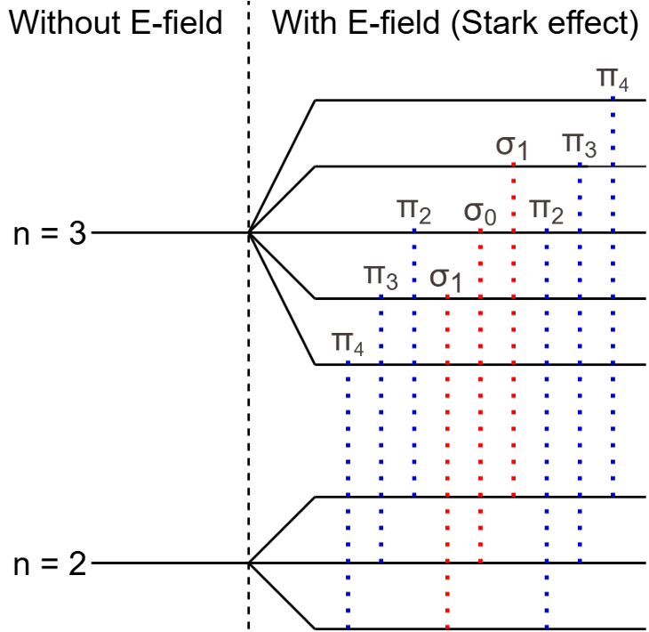{#fig-D_alpha1 width=70%}

In @fig-D_alpha1, the line splitting of the energy levels with principal quantum numbers $n=2$ and $n=3$ is shown. For clarity, the fine structure splitting is omitted. 

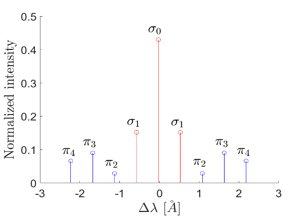{#fig-D_alpha2 width=80%}

The separation of the spectral lines, as shown in @fig-D_alpha2, is directly proportional to the strength of the electric field @sacha2025thesis:

$$
\Delta \lambda \approx \frac{3ea_0|\mathbf{E_L}|\lambda_0^2}{2hc}
$$

where $\lambda_0$ is the unshifted Balmer-$\alpha$ wavelength, $h$ is Planck's constant, and $c$ is the speed of light.

The $\pi$ and $\sigma$ components are respectively polarized parallel and perpendicular to the electric field. This means that when trying to capture the radiation, the intensity of the components depends on the direction of the Line-of-Sight (LOS) with respect to $\mathbf{E_L}$. Defining $\Psi$ as the angle between the LOS and $\mathbf{E_L}$, the observed intensities scale as:

$$
I_{\sigma} \propto 1 + \cos^2\Psi
$$

$$
I_{\pi} \propto \sin^2\Psi
$$

## MSE Diagnostic on TCV

The MSE diagnostic on TCV relies on the deuterium neutrals injected by the [NBI-1 of TCV](NBI.qmd). Along the beam, 20 LOS are defined, originating from the optical setup at the bottom of TCV, as shown in @fig-LOS_TCV.

::: {#fig-LOS_TCV layout-ncol="2"}
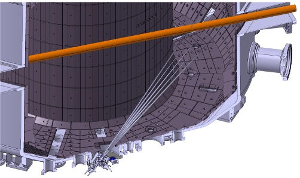{#fig-LOS_TCV1 width=80%}

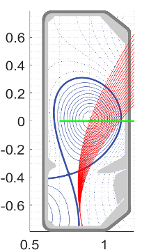{#fig-LOS_TCV2 width=40%}
:::

To detect the Doppler-shifted radiation emitted by the neutral beam, each Line-of-Sight (LOS) must be oriented at an angle other than $90^\circ$ relative to the beam direction. This arrangement ensures that the neutral beam has a velocity component along the LOS, making the Doppler-shifted emission distinguishable from the background plasma radiation.

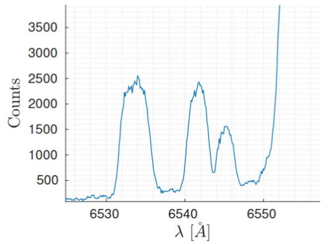{#fig-Dalpha_emission}

As shown in @fig-Dalpha_emission, the D$_{\mathrm{\alpha}}$ spectrum exhibits several distinct peaks:
- The full-energy peak corresponds to emission from D$^+$ ions.
- The half-energy peak arises from D$^+_2$ ions.
- The third-energy peak is due to D$^+_3$ ions.
- The remaining portion of the spectrum is non-shifted radiation emitted by the plasma.

These energy shifts result from the different velocities of the ion species, which are determined by their respective masses.

| LOS | R$_\mathrm{inter}$ [m] | $\alpha$ [deg] | Doppler shift ∆$\lambda$ [Å] | resolution ∆R [cm⁻¹] |
|:---:|:----------:|:-------:|:---------------------:|:----------------------:|
|  1  | 1.1062     | 138.61  | -27.1349              | 6.4                    |
|  2  | 1.0920     | 138.04  | -26.8964              | 6.5                    |
|  3  | 1.0783     | 137.48  | -26.6568              | 6.4                    |
|  4  | 1.0651     | 136.91  | -26.4158              | 6.1                    |
|  5  | 1.0524     | 136.35  | -26.1734              | 5.8                    |
|  6  | 1.0402     | 135.80  | -25.9294              | 5.6                    |
|  7  | 1.0278     | 135.24  | -25.6837              | 5.5                    |
|  8  | 1.0163     | 134.69  | -25.4361              | 5.2                    |
|  9  | 1.0053     | 134.13  | -25.1867              | 5.0                    |
| 10  | 0.9952     | 133.58  | -24.9351              | 4.8                    |
| 11  | 0.9849     | 133.03  | -24.6813              | 4.6                    |
| 12  | 0.9748     | 132.48  | -24.4251              | 4.4                    |
| 13  | 0.9651     | 131.92  | -24.1664              | 4.2                    |
| 14  | 0.9556     | 131.37  | -23.9049              | 4.1                    |
| 15  | 0.9464     | 130.81  | -23.6407              | 3.9                    |
| 16  | 0.9374     | 130.26  | -23.3733              | 3.7                    |
| 17  | 0.9283     | 129.70  | -23.1028              | 3.5                    |
| 18  | 0.9198     | 129.14  | -22.8288              | 3.4                    |
| 19  | 0.9116     | 128.57  | -22.5512              | 3.2                    |
| 20  | 0.9035     | 128.00  | -22.2697              | 3.0                    |

: Parameters of each LOS. R$_\mathrm{inter}$ is the radial position of the intersection between the LOS and NBI-1, $\alpha$ is the angle between the LOS and NBI-1, ∆$\lambda$ is the Doppler shift, and ∆R is the radial resolution @sacha2025thesis. {#tbl-measurement}

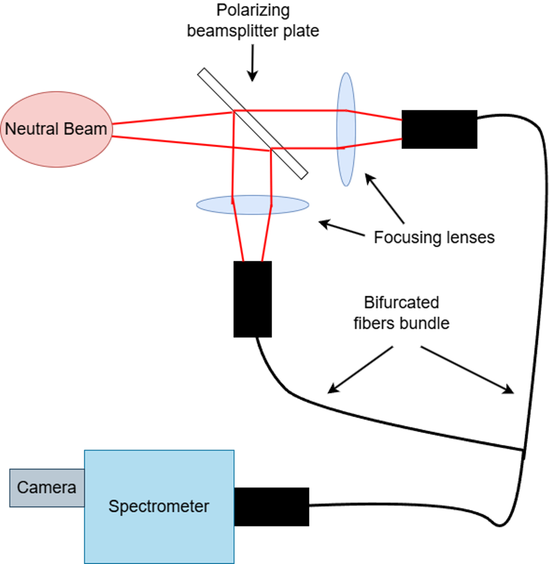{#fig-optical_setup}

The optical setup, shown in @fig-optical_setup, is composed of:
- A **beamsplitter plate** used to separate two orthogonal light polarizations of the $D_\alpha$ emission into two different branches. This is done because only the Motional Stark and the Zeeman effects influence the line polarization. A thin plate was chosen to minimize the rotation $\beta$ of the light polarization due to the Faraday effect. Currently, taking into account the 5 mm diagnostic window and the beamsplitter plate, the total theoretical rotation is:
  $$\beta = \beta_{\mathrm{w}} + \beta_{\mathrm{p}} \approx 1.2^\circ + 0.3^\circ = 1.5^\circ$$

- **2 lenses**, one for each branch, used to focus the light into the optical fibers.
- **40 optical fibers**, 20 per branch, which transmit the light to the [spectrometer](Optical_spectrometer.qmd) and the camera.

| **Parameter** | **Spectrometer** | **Camera** | **Fibers** |
|----------------------------|----------------------------|------------------------|--------------------------|
| Focal length               | 500 mm                     |                        |                          |
| F#                         | 4                          |                        |                          |
| Grating                    | 2400 grooves/mm            |                        |                          |
| Resolution                 | ~ 0.5 Å                    |                        |                          |
| Range                      | 3800-8000 Å                |                        |                          |
| Model                      |                            | Andor EMCCD            |                          |
| Pixel size                 |                            | 13 µm                  |                          |
| Array size                 |                            | 1024x1024              |                          |
| Time resolution            |                            | 20 ms                  |                          |
| Camera range               |                            | 3800-9000 Å            |                          |
| Length of each fiber       |                            |                        | 30 m                     |
| Core diameter              |                            |                        | 295 µm                   |
| # fibers per branch        |                            |                        | 20                       |
| # branches                 |                            |                        | 2                        |
| Fiber range                |                            |                        | 3800-8500 Å              |

: Parameters of the optical components @sacha2025thesis. {#tbl-optical_components}

---

## Diagnostic Calibration

Because any systematic offset in the optical collection system or unaccounted magnetic interactions with the vacuum window will propagate as severe errors in the equilibrium reconstruction, meticulous calibration is required. This section details two primary calibration experiments performed to characterize the MSE optical transmission system.

### Part 1: Characterization of the Polarizing Beam Splitter (PBS)

To characterize the absolute transmission angle of the PBS plate, a bench calibration was performed. A Neon lamp was used as a stable light source, coupled with an integrating sphere to ensure uniform, unpolarized illumination.  The light then passed through a highly linear polarizing filter mounted on a precision rotation stage, followed by the PBS plate. 

The PBS splits the beam into two orthogonally polarized components, which are routed to alternating fibers (odd and even) on the spectrometer entrance slit. 

**Theoretical Background: Malus's Law and the Normalized Difference**
The intensity of light transmitted through a polarizer follows Malus's Law. To isolate the polarization angle $\theta_{PBS}$ and eliminate fluctuations in the light source and common baseline offsets, we calculate the Normalized Difference (equivalent to the Stokes Q parameter):

$$
C = \frac{I_{odd} - I_{even}}{I_{odd} + I_{even}} = \cos(2(\theta_p - \theta_{PBS}))
$$

Where $\theta_p$ is the known angle of the rotating polarizer, and $\theta_{PBS}$ is the unknown transmission axis of the beam splitter.

**Data Analysis and Results**
The polarizer was rotated through an array of angles from 0° to 180°. Background light was subtracted, and the spectral lines were integrated. The Normalized Difference was calculated for each of the 20 spatial Lines of Sight (LOS) and fitted to the cosine function.

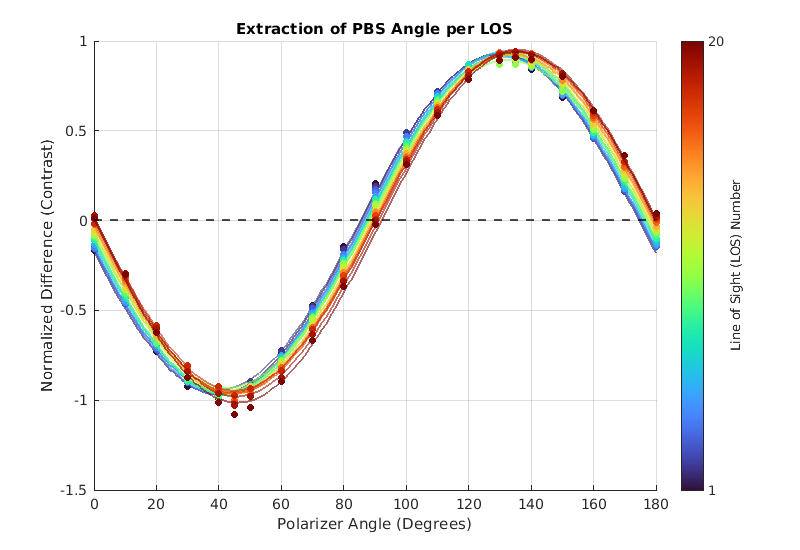

**Observation:** The normalized difference data perfectly follows the expected $\cos(2\theta)$ theoretical curve. The color gradient (from LOS 1 to 20) reveals a slight but systematic phase shift across the fiber array, indicating that the effective angle of the PBS varies slightly depending on the geometric path of the light.

To quantify this spatial variation, the fitted $\theta_{PBS}$ for each LOS was plotted against its spatial position:

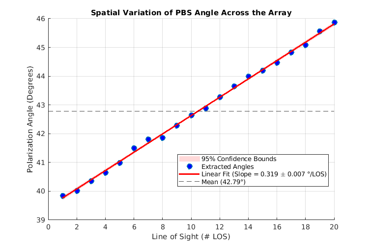

**Observation:** The polarization angle of the PBS exhibits a highly linear spatial dependence, shifting from approximately 39.8° at LOS 1 to 45.9° at LOS 20. The linear fit yields a spatial gradient of $0.319^\circ/\text{LOS}$, with a global mean angle of $42.79^\circ$. This linear variation is a physical consequence of the varying Angle of Incidence of the off-axis rays hitting the dielectric coating of the PBS.

**Conclusion for Part 1:** The analysis successfully mapped the beam splitter angle across the entire array. The global mean offset of $\theta_{PBS} = 42.79^\circ$ was established as the baseline reference required to unwrap the absolute angles in the subsequent in-vessel calibration.

---

### Part 2: In-Situ Faraday Rotation Calibration

When the MSE optical components (specifically the vacuum window) are subjected to the strong magnetic fields of the TCV tokamak, the glass becomes optically active. This induces a rotation in the polarization plane of the transmitted light, known as the Faraday effect. 

**Experimental Setup**
To calibrate this *in-situ*, an LED light source was placed inside the vessel. To generate a well-defined initial polarization state, and to induce the Faraday rotation effect, a 1 mm thick polarizing filter was installed in front of the LED. The polarizer was manually aligned to an intended angle of 0° by visually monitoring the light intensity reaching the optical fibers. Data was acquired during specific TCV shots (89364, 89363, 89362) where the toroidal magnetic field was ramped up and down, including both positive and negative field directions. Background noise was characterized and subtracted using a dedicated dark shot (89365).

**Theoretical Background: The Faraday Effect**
The Faraday rotation angle $\theta_F$ is directly proportional to the magnetic field component parallel to the light's propagation path:

$$
\theta_F = V \int \mathbf{B} \cdot d\mathbf{l}
$$

For our optical setup, this manifests as a linear rotation proportional to the Toroidal Magnetic Field ($B_{tor}$). Because the Faraday effect is an odd function, reversing the magnetic field direction precisely reverses the rotation angle, providing a robust absolute zero-calibration reference.

**Data Analysis and Phase Detection**
A dynamic masking algorithm was developed to isolate the pure magnetic ramping and descending phases across multiple shots. By evaluating the time derivative of the magnetic field magnitude ($dB/dt$), the analysis automatically extracts valid calibration windows while excluding noisy startup phases and the flat-top phase (where plasma light would contaminate the LED signal).

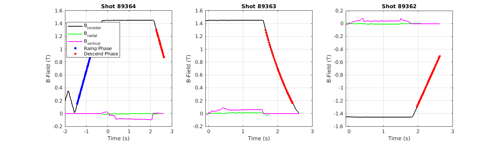

**Observation:** The dynamic phase detection successfully isolated the ramping (blue dots) and descending (red dots) periods for all three shots. 

By applying the previously measured beam splitter offset ($\theta_{PBS} = 42.79^\circ$), the absolute physical polarization angle was continuously calculated during these magnetic sweeps.

**Results: Absolute Angle and Faraday Constant Extraction**
The absolute polarization angle was plotted against the toroidal magnetic field across the full positive and negative domain to extract the physical rotation constant.

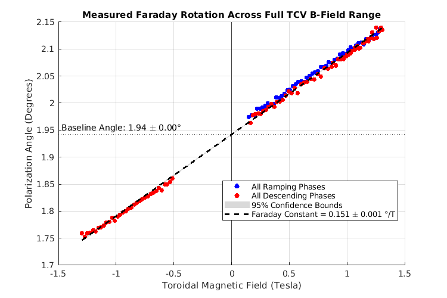

**Observation:** The experimental data demonstrates a remarkably clean linear dependence on the magnetic field, verifying the Faraday effect. Several key physical insights are derived from this plot:

1. **Lack of Hysteresis:** The ramping (blue) and descending (red) phases overlap perfectly, indicating that the magnetic field at the window location does not suffer from mechanical or magnetic hysteresis relative to the measured coil currents.
2. **The Faraday Constant (Slope):** The linear fit yields a global Faraday rotation constant of $0.151^\circ/\text{T}$. This value allows for direct correction of future MSE plasma measurements based on the instantaneous toroidal field.
3. **Absolute Zero Calibration (Y-Intercept):** Evaluating the fit at exactly 0 T reveals a baseline angle of $1.94^\circ$. Because Faraday rotation is strictly zero in the absence of a magnetic field, this intercept mathematically reveals the true incoming angle of the polarized LED light. This explicitly demonstrates that the attempt to manually fix the polarizer to 0° by eye was slightly misaligned, with the true physical angle being $1.94^\circ$. 
4. **Spatial Uniformity**: An analysis was performed grouping the 20 Lines of Sight into spatial pairs to check for geometric path-length variations (the L/cos(γ) effect). Because the vacuum window is extremely thin (2 mm), the spatial variation in the Faraday slope was found to be dominated by the detector noise floor. This justifies the use of a single, globally averaged Faraday constant for all Lines of Sight.

## Ideal vs. Integrated Spectra: The Impact of Finite Measurement Volumes

In simplified MSE analysis, the measured emission is often approximated as originating from a single, infinitesimally small intersection point between the diagnostic Line-of-Sight (LOS) and the centerline of the neutral beam. 

However, the physical reality of the diagnostic entails a finite measurement volume. The intersection between the expanded optical viewing cone of the fiber and the physical width of the neutral beam creates an active integration region spanning several centimeters along the LOS. 

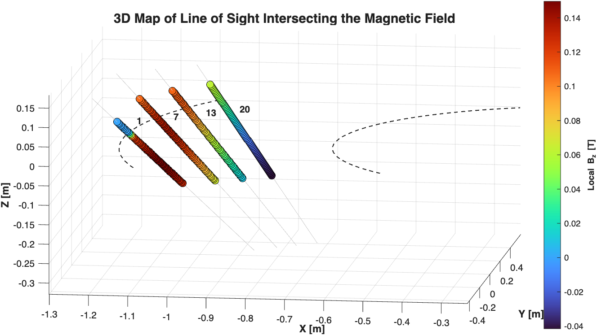{#fig-beam_intersection width=80%}

Because the magnetic field exhibits spatial gradients within the tokamak, the magnetic field vector changes continuously as the LOS traverses this active beam volume. @fig-beam_intersection and @fig-Bz_along_LOS illustrate how the vertical magnetic field component, $B_z$, varies significantly along the active integration path.

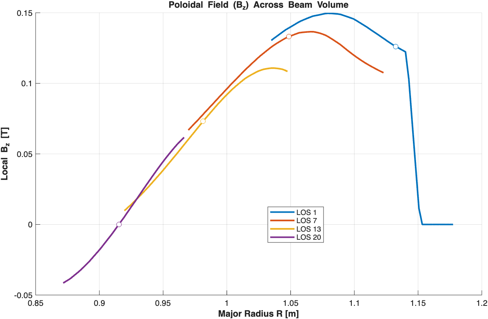{#fig-Bz_along_LOS width=80%}

The total measured spectral intensity is therefore a line integral of the local emissivity $j(\lambda, s)$ along the path $s$:

$$
I(\lambda) = \int j(\lambda, s) ds
$$

### Conservation of Photons and Spectral Smearing

This spatial integration has an impact on the shape of the measured Stark multiplet. Because the Stark splitting $\Delta \lambda$ is directly proportional to $|\mathbf{v} \times \mathbf{B}|$, the continuous variation of the magnetic field along the integration path causes the Stark lines to shift slightly at every point within the volume.

When these infinitesimally shifted local spectra are summed together to form the **Integrated Spectrum**, the resulting peaks undergo a specific geometric broadening. 

If an experimental fitting algorithm relies purely on an ideal point-source forward model, this geometric "smearing" can be misinterpreted as anomalous thermal broadening, or lead to systematic errors in the inferred polarization fractions. 

::: {#fig-bz_fits layout-ncol="2"}
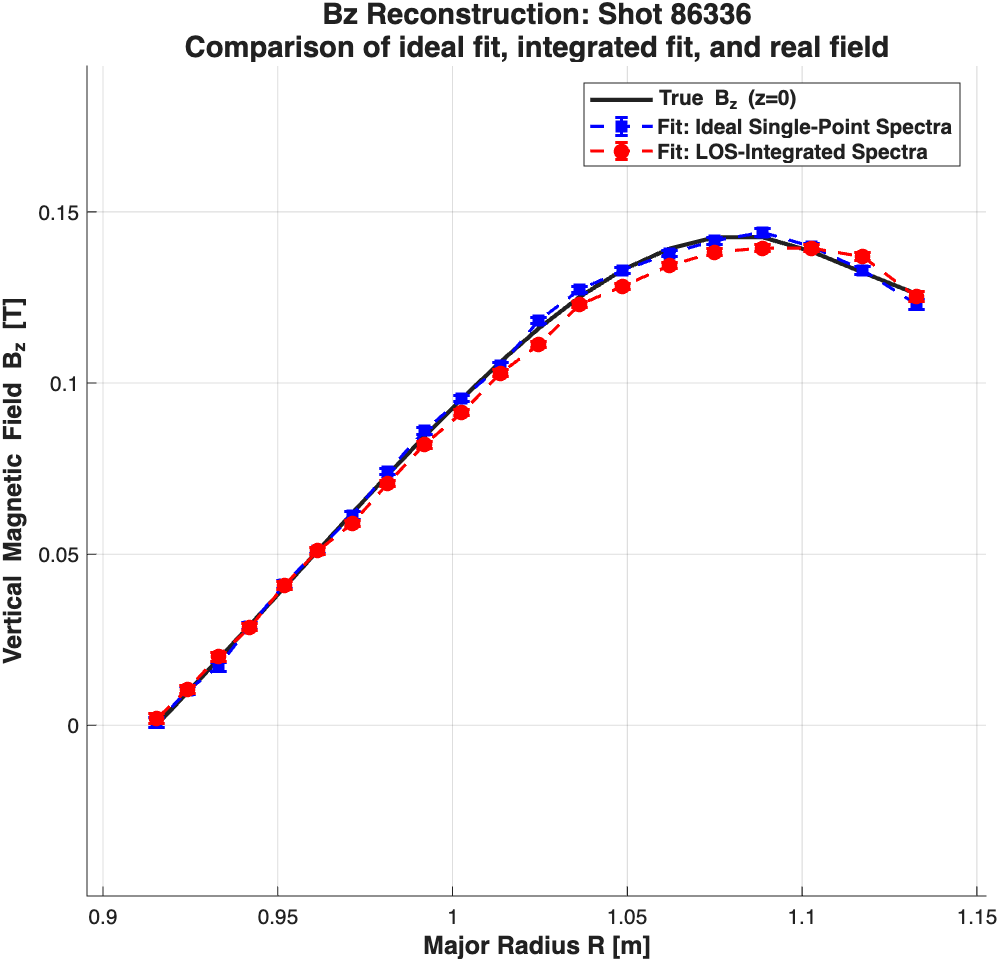{#fig-bz_full}

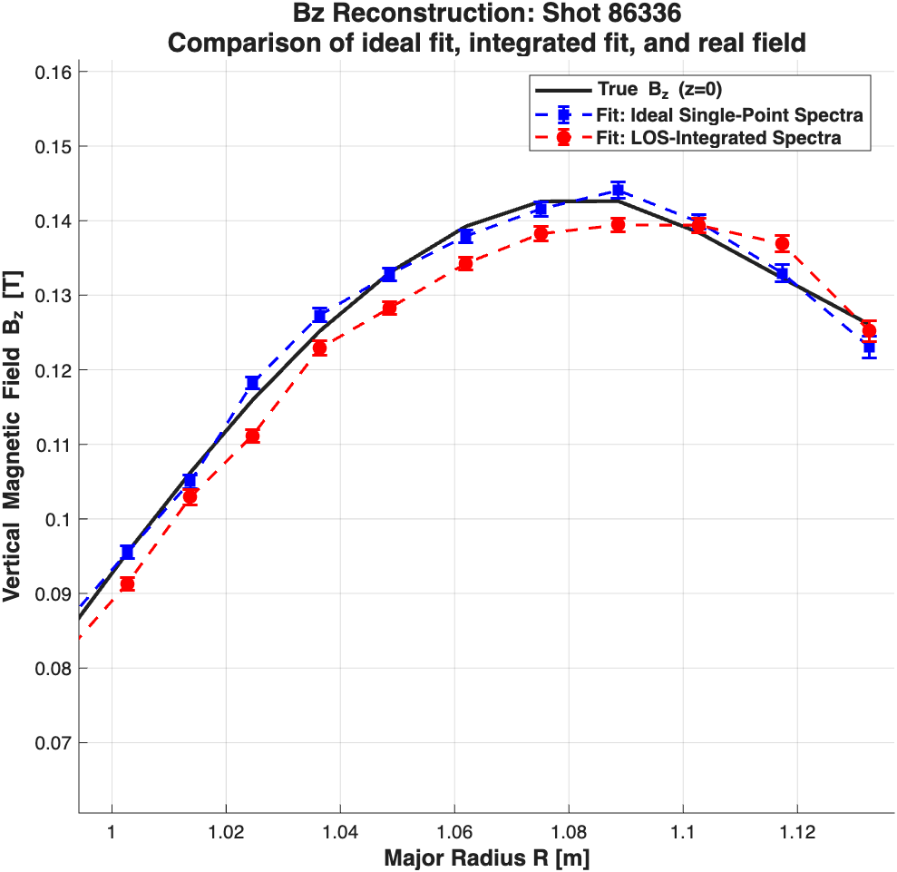{#fig-bz_zoom}

Comparison of reconstructed $B_z$ profiles between the Ideal single-point assumption and the full 3D Integrated model (Shot 86336, t=1.3s).
:::

### Synthetic Diagnostic Validation

To quantify the impact of the 3D spatial integration, @tbl-ideal-vs-integrated presents the recovered vertical magnetic field ($B_z$) for TCV shot 86336 at $t = 1.3$ s. The relative error is computed with respect to the known True LIUQE equilibrium. 

| LOS | True $B_z$ [T] | Ideal $B_z$ [T] | Rel. Error Ideal [%] | Integrated $B_z$ [T] | Rel. Error Int [%] |
|:---:|:---:|:---:|:---:|:---:|:---:|
| 1 | 0.1261 | 0.1230 | 2.46 | 0.1252 | 0.71 |
| 2 | 0.1323 | 0.1330 | 0.53 | 0.1369 | 3.48 |
| 3 | 0.1384 | 0.1398 | 1.01 | 0.1394 | 0.72 |
| 4 | 0.1426 | 0.1440 | 0.98 | 0.1394 | 2.24 |
| 5 | 0.1426 | 0.1416 | 0.70 | 0.1382 | 3.09 |
| 6 | 0.1392 | 0.1379 | 0.93 | 0.1343 | 3.52 |
| 7 | 0.1330 | 0.1328 | 0.15 | 0.1283 | 3.53 |
| 8 | 0.1252 | 0.1273 | 1.68 | 0.1229 | 1.84 |
| 9 | 0.1159 | 0.1182 | 1.98 | 0.1112 | 4.06 |
| 10 | 0.1062 | 0.1050 | 1.13 | 0.1029 | 3.11 |
| 11 | 0.0954 | 0.0955 | 0.10 | 0.0913 | 4.30 |
| 12 | 0.0843 | 0.0860 | 2.02 | 0.0820 | 2.73 |
| 13 | 0.0731 | 0.0741 | 1.37 | 0.0706 | 3.42 |
| 14 | 0.0620 | 0.0613 | 1.13 | 0.0589 | 5.00 |
| 15 | 0.0510 | 0.0511 | 0.20 | 0.0509 | 0.20 |
| 16 | 0.0402 | 0.0411 | 2.24 | 0.0408 | 1.49 |
| 17 | 0.0293 | 0.0290 | 1.02 | 0.0286 | 2.39 |
| 18 | 0.0192 | 0.0171 | 10.94 | 0.0200 | 4.17 |
| 19 | 0.0095 | 0.0101 | 6.32 | 0.0105 | 10.53 |

: Comparison of reconstructed magnetic fields ($B_z$) between the Ideal single-point assumption and the full 3D Integrated model. {#tbl-ideal-vs-integrated}

**Summary of Relative Errors:**

* **Mean Error (Ideal, excluding LOS 20):** $1.94\%$
* **Mean Error (Integrated, excluding LOS 20):** $3.18\%$

## References

```{bibliography}